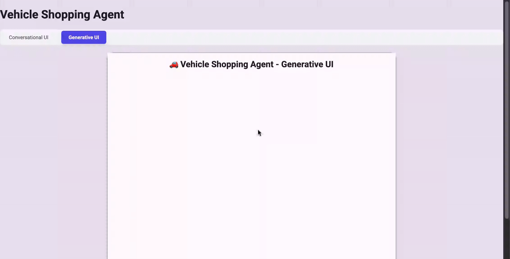
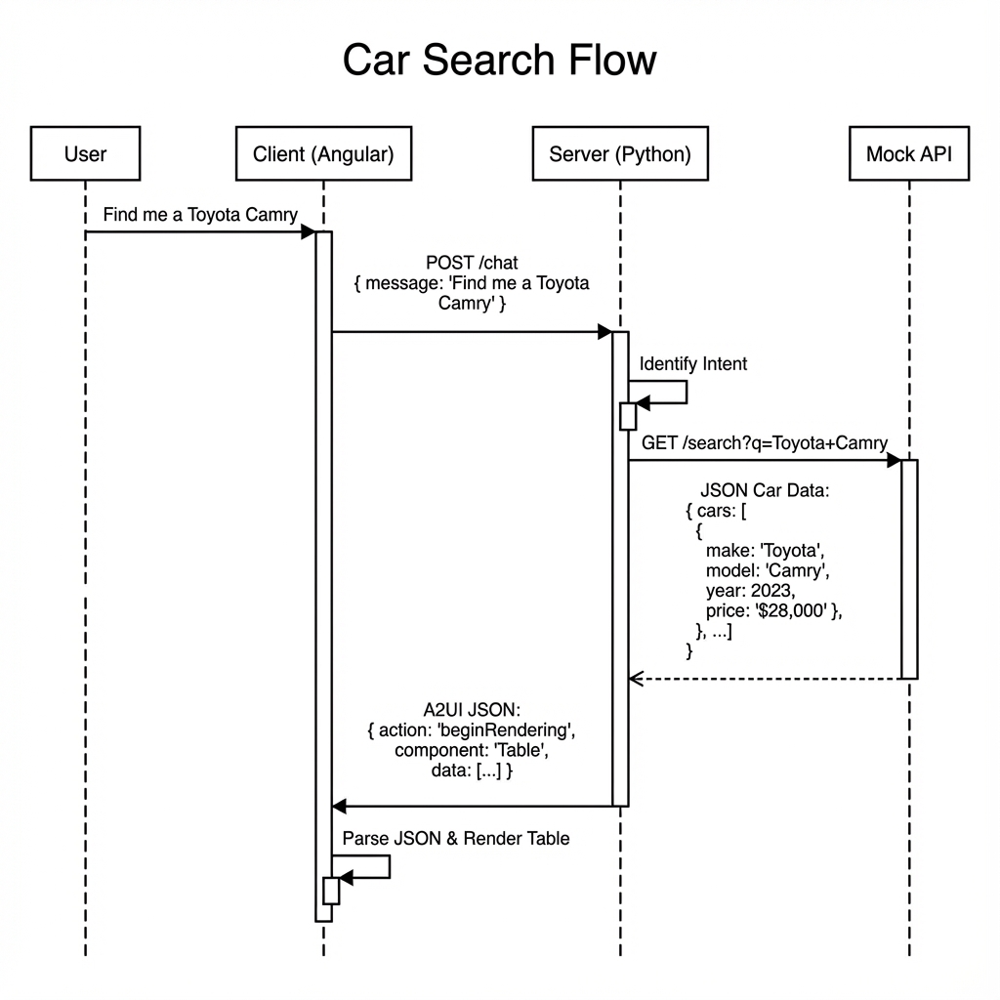

# Vehicle Shopping Agent

A comprehensive conversational AI system designed to assist users with vehicle-related tasks including searching, comparing, booking, and analyzing market trends. Built using Google's Agent Development Kit (ADK), FastAPI, A2UI (Agent to UI protocol), and Angular.

## Generative UI Demo

This demo highlights how multiple types of UI elements such as:
-  user and agent interactions
-  lists (for search results
-  cards (for product details and comparison)
-  forms (for booking, payments, order confirmation), etc.) 

can be dynamically generated and rendered in a conversational interface.



## Project Overview

The Vehicle Agent orchestrates multiple specialized sub-agents to handle specific user intents:

- **Product Search Agent**: Finds vehicles based on criteria (make, model, type).
- **Product Compare Agent**: Compares specifications of two vehicles.
- **Product Book Agent**: Schedules test drives or inspections.
- **Product Negotiate Agent**: Handles price negotiation logic.
- **Market Trend Agent**: Provides insights on current market trends (e.g., EVs in Singapore).

## Key Features

- **Rich UI Rendering (A2UI)**: Dynamic generation of Tables, Comparison Cards, and Booking Forms driven by backend payloads.
- **Dual UI Modes**:
  - **Conversational UI**: Clean, text-based chat interface.
  - **Generative UI**: Visual, interactive component rendering.
- **Robust Validation**: Server-side Schema Validation ensures only valid A2UI payloads reach the frontend.

The system features a **Dynamic UI** built with Angular that supports rich interactions and a **Python Backend** powering the agent logic.

## Prerequisites

- **Python**: `>=3.13`
- **Node.js**: `v20+` (Recommended) / `npm` `v10+`
- **uv**: Required for Python dependency management. [Install uv](https://github.com/astral-sh/uv).
- **Google Cloud Project & API Key**: Required for Gemini models.

## Quick Start

1.  **Install Dependencies**

    ```bash
    # Install Python dependencies (creates .venv)
    uv sync

    # Install Frontend dependencies
    cd web
    npm install
    cd ..
    ```

2.  **Configure Environment**
    Create a `.env` file in the root directory to configure the services. This is required for custom configurations.

    ```ini
    # Core Configuration
    GOOGLE_API_KEY="your_api_key_here"

    # Server Ports & URLs
    PORT=8000
    MOCK_API_PORT=9999
    MOCK_API_URL="http://localhost:9999"
    UI_PORT=4200

    # Security
    ALLOWED_ORIGINS="http://localhost:4200,http://localhost:3000,http://127.0.0.1:4200"
    ```

3.  **Run the Application**
    Use the all-in-one demo script to start the Mock API, Agent Server, and Angular UI:
    ```bash
    ./scripts/run_demo.sh
    ```
    - **UI**: [http://localhost:4200](http://localhost:4200)
    - **Agent Server Docs**: [http://localhost:8000/docs](http://localhost:8000/docs)
    - **Mock API Docs**: [http://localhost:9999/docs](http://localhost:9999/docs)

## Testing

### Unit & Integration Tests (Backend)

Runs `pytest` with coverage for the `servers` and `agent_app` modules.

```bash
./scripts/run_server_tests.sh
```

**Code Coverage**:

- **Console Report**: Displayed after tests.
- **HTML Report**: `log/htmlcov/index.html`.
- **Trace File**: `log/.coverage` (Consolidated).

### UI / E2E Tests (Frontend)

Runs **Playwright** tests to verify the full chat flow, agent capabilities, and UI responsiveness.

```bash
./scripts/run_ui_tests.sh
```

- **Note**: This script automatically starts all necessary services before running tests.

## Architecture

The system follows a modular client-server architecture:


### Frontend (Angular)

- **Location**: `web/`
- **Tech Stack**: Angular 21+ (Standalone Components), Signals, RxJS.
- **Role**: Handles user input, displays streaming agent responses, and manages UI state (loading, focus).
- **Communication**: Sends HTTP POST requests to the Agent Server (`/chat`).
- **A2UI Surfaces**:
  - `table`: Grid view for vehicle search results.
  - `card-comparison`: Side-by-side spec comparison.
  - `booking-form`: Context-aware form for scheduling.
  - **Event Handling**: Client events (e.g., `rowSelect`) are sent back to the agent for context-aware follow-ups.

### Client-Server Integration (A2UI)

The system uses the **Agent-to-UI (A2UI)** protocol to drive rich interfaces. Instead of just text, the agent sends structured JSON commands that the frontend interprets to render dynamic components.

#### Sequence Diagram: Search & Render Flow



#### Client Events (User Actions)

When a user interacts with a component (e.g., clicking "Book" or submitting a form), the frontend acts as follows:

1.  **Local Updates**: Some actions (like opening a booking form inside a card) are handled locally by `AgentService` for instant feedback.
2.  **Server Events**: Critical actions (like `formSubmit`) are sent to the server as standard chat messages prefixed with `EVENT:`.
    - Example: `EVENT: { "type": "formSubmit", "payload": { ... } }`
    - The Server processes this event, calls the `book_appointment` tool, and returns a confirmation message.

### Backend (Python)

- **Location**: `servers/`, `agent_app/`
- **Tech Stack**: FastAPI, Google GenAI ADK, Uvicorn.
- **Components**:
  - **Agent Server** (`servers/agent_server.py`): The main entry point. Initializes the `RootAgent` and exposes it via REST API.
    - **Safety Gate**: Validates all A2UI messages against a strict JSON schema before sending.
  - **Agent Logic** (`agent_app/agent.py`): Defines the `LlmAgent`, tools, and sub-agent hierarchy.
  - **Mock API Server** (`servers/mock_api_server.py`): Simulates an external vehicle inventory and booking system. Serves data from `data/*.json`.

## Built with Google AntiGravity IDE

This entire demo was constructed using the **Google AntiGravity IDE**, an advanced agentic development environment that turns high-level prompts into full-stack applications.

The development process was driven by natural language instructions located in the `__instructions__` directory:

- [Gemini.md](__instructions__/Gemini.md): Defined the multi-agent backend architecture, tool specifications, and API mock requirements.
- [A2UI.md](__instructions__/A2UI.md): Specified the Agent-to-UI (A2UI) protocol, frontend requirements, and generative UI component definitions.
- [UI.md](__instructions__/UI.md): Outlined the core requirements for the Angular-based responsive web application and chat interface.
- [Testing.md](__instructions__/Testing.md): Provided manual verification steps and test cases for the ADK agent.
- [demo_script.md](__instructions__/demo_script.md): Script used for recording the demo video, detailing the specific steps and user interactions using the AntiGravity browser agent.

The AntiGravity IDE consumed these markdown files and autonomously:

1.  Scaffolded the **FastAPI** backend and **Angular** frontend.
2.  Implemented the **Multi-Agent System** using Google GenAI ADK.
3.  Generated the **Mock Data** and API endpoints.
4.  Wired up the **A2UI Protocol** for dynamic component rendering.
5.  Beyond the above md files, other instructions were given iteratively to build the demo.

### Directory Structure

```
.
├── agent_app/       # Agent logic and definitions
├── data/            # Mock data for the API server is self contained in repo so that it is easy to run this demo
├── scripts/         # Helper shell scripts (run, test, lint)
├── servers/         # FastAPI server implementations
├── ui-tests/        # Playwright E2E tests
├── web/             # Angular Frontend application
├── pyproject.toml   # Python dependencies (uv)
└── uv.lock          # Locked dependencies
```
